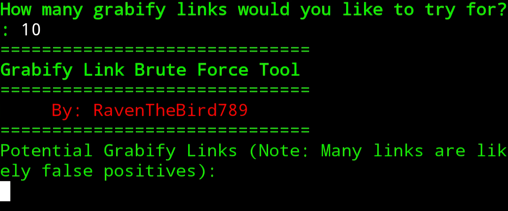
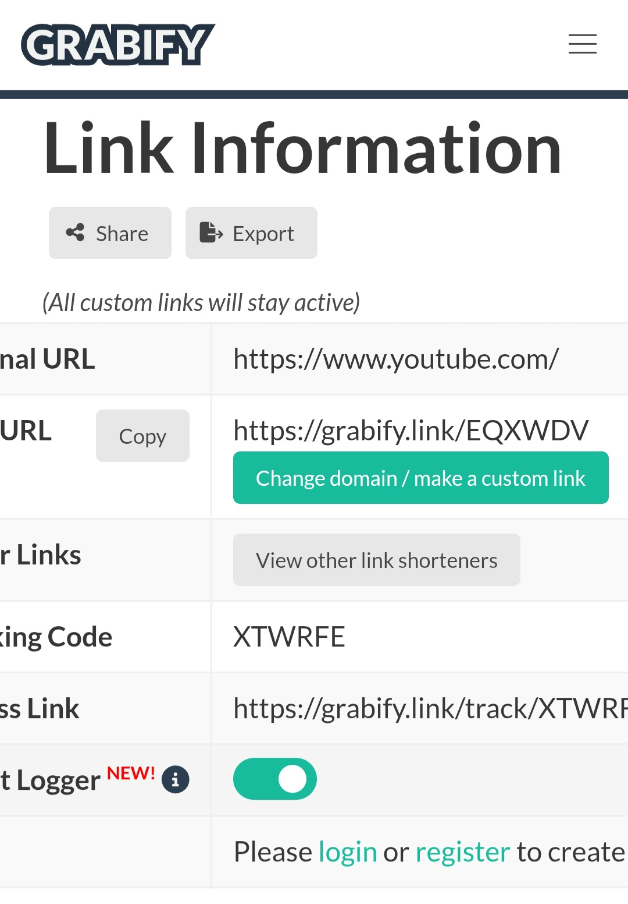
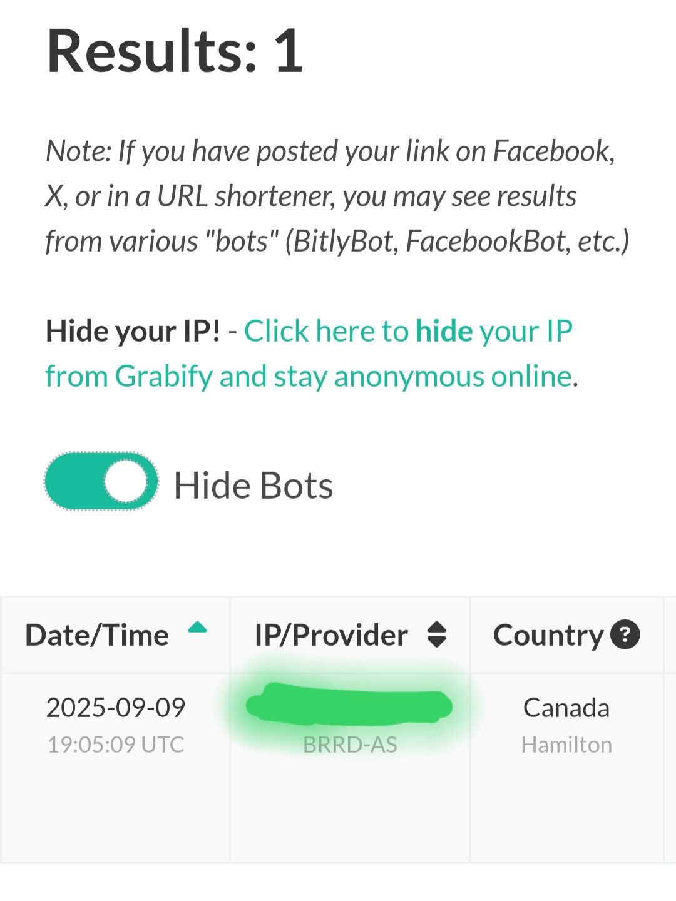
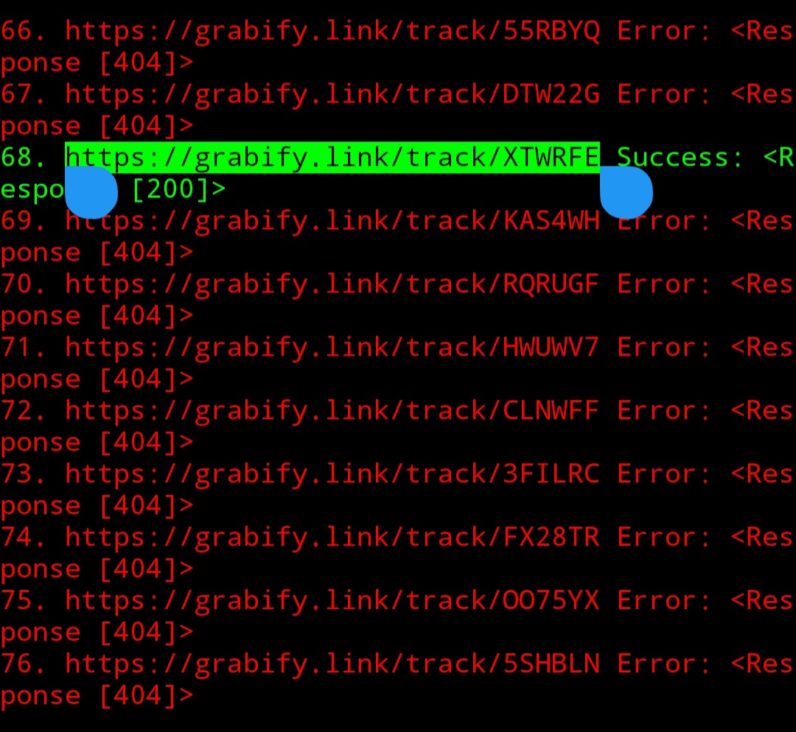

# Grabify Link Brute Force Tool ❇️
Brute force tool that generates possible endpoints for grabify's "track" subdirectory



Explanation
* Because Grabify links don't require user authentication to view their status (Broken Access Control Vulnerability. Particularly, Horizontal Privilege Escalation and IDOR), brute force algorithms can be used to guess the alphanumeric endpoints of the "track" subdirectory. This can expose ip addresses of users which can be used maliciously by attackers for various purposes such as DDOS, remote access, MITM attacks, network mapping, etc.




Requirements:
* Ensure that the latest version of python is installed in your terminal (python 3.x)
* Ensure you have a virtual env for the required python libraries (If you don't, one can easily be created by executing the command "python3 -m venv env")

Recommendations:
* Use a VPN while using this tool (Proton or Mullvad are encouraged)
* Enable TOR in your terminal
* Run proxychains4 while executing the software (This comes pre-installed with Kali-Linux)

Installation & setup

```bash
git clone https://github.com/RavenTheBird789/Grabify-Link-Brute-Force-Tool
cd Grabify-Link-Brute-Force-Tool
python3 -m venv env
source env/bin/activate
pip install -r requirements.txt
```

To run

```bash
python3 gLink_BF_Tool.py
```

Optional shortcut

```bash
alias gl="python3 gLink_BF_Tool.py"
```

Important Information:
* As stated in the [gLink_BF_Tool.py](gLink_BF_Tool.py) file, due to the very nature of brute force algorithms, there's a high chance that many of the links are false positives (404 errors returned to the user due to faulty url endpoint)
* In the event that the status code of a GET request made with a generated grabify link is neither 200 (successful) or 404 (error) the text generated along with the link will be yellow instead of green (200) or red (404)
* The documentation detailing the full process of how I identified this vulnerability and successfully exploited it can be found in the [Documentation.txt](Documentation.txt) file


